# Gunhed — Boot Sequence & Sound Test Disassembly

ROM: `Gunhed (Japan).pce` — CRC32 `A17D4D7E`, 384 KB (48 × 8 KB banks)  
CPU: HuC6280 (65C02 derivative + MMU, PSG, timer, I/O)

---

## Program Flow — Mermaid Diagram

```mermaid
flowchart TD
    subgraph RESET ["Reset Vector → Boot"]
        R["$E000: RESET"] --> INIT["$E000–$E076: Hardware Init
        SEI, CSH (7.16 MHz), CLD
        Map banks: MPR0=$FF, MPR1=$F8, MPR7=$00
        Init stack ($21FF), zero-page clear
        VDC setup (256×224, VRAM clear)
        Timer/IRQ vector setup
        Clear VRAM $0000–$7FFF"]
        INIT --> VBLANK_ON["$E077: JSR $F922
        Enable VBLANK IRQ in VDC CR
        CLI — interrupts fire"]
    end

    subgraph IRQ ["IRQ1 Handler (runs every VBLANK)"]
        direction LR
        IRQ1["$EB03: IRQ1 Handler
        INC $10 (frame counter)
        Scroll updates
        JSR $4000 / $C000
        RTI"]
    end

    VBLANK_ON -.->|"fires every ~16ms"| IRQ1

    subgraph BOOT_TAIL ["Boot Tail — Mode Transition"]
        VBLANK_ON --> CLEAR_VARS["$E07A–$E083: Clear score/state
        STZ $3000–$3003"]
        CLEAR_VARS --> SEI2["$E086: SEI — mask interrupts"]
        SEI2 --> VDC_OFF["$E08A: JSR $F926
        VDC CR &= $F0
        ★ Disable ALL VDC IRQ sources
        (VBLANK off at hardware level)"]
        VDC_OFF --> MODE["$E08D: MODE $32
        Map banks for sound test:
        MPR2=$08, MPR3=$09
        MPR4=$05, MPR5=$01, MPR6=$02"]
        MODE --> ENTER["$E092: JSR $4005
        Enter Bank $08 — Sound Test"]
    end

    subgraph BANK08_INIT ["Bank $08 — Init ($4005–$4046)"]
        ENTER --> DISABLE_BG["$4005: JSR $F91E
        Disable BG + sprites"]
        DISABLE_BG --> INIT_TABLES["$4008: JSR $F173
        Init system tables"]
        INIT_TABLES --> TII_COPY["$400B: TII $58F1→$2220, 239 bytes
        Copy lookup table to RAM"]
        TII_COPY --> CLI2["$4023: CLI
        Unmask interrupts
        (but VDC sources still OFF
        → no VBLANK fires yet)"]
        CLI2 --> FARCALL["$4024: JSR $EF22 → $49C2
        Far-call: stop sound
        ★ v6 PATCH: 6× NOP"]
        FARCALL --> SET_FLAG["$402A: LDA #$01; STA $90
        Set game-mode flag"]
        SET_FLAG --> CLEAR_RAM["$402E: STZ $3000
        $4031: TII $3000→$3001, 2303 bytes
        Zero-fill RAM"]
        CLEAR_RAM --> FONT_INIT["$4038: LDA #$19; LDY #$02
        JSR $F2FE — palette/font init"]
        FONT_INIT --> PAL_INIT["$403F: LDA #$00
        JSR $F38E — palette/color init"]
        PAL_INIT --> VBLANK_RE["$4044: JSR $F922
        ★ Re-enable VBLANK IRQ
        VDC CR |= $0A + CLI"]
    end

    subgraph INTRO ["Intro Animation ($4047–$4161)"]
        VBLANK_RE --> INTRO_START["$4047–$405E: Intro setup
        Set scroll position, clear arrays
        ★ v6 PATCH: JMP $4162 here"]
        INTRO_START --> INTRO_LOOP["$405F–$40BD: Animation loop
        Fade-in, scroll text, draw stars
        Check joypad for P2 skip"]
        INTRO_LOOP -->|"P2 button pressed"| SKIP_INTRO["$40B8: JMP $4162
        Skip to menu"]
        INTRO_LOOP -->|"animation complete"| SKIP_INTRO
        INTRO_LOOP -->|"P1 run pressed"| RESET_JMP["$40DB: JMP $E000
        Full reset"]
    end

    subgraph MENU_ENTRY ["Menu Entry ($4162–$4189)"]
        SKIP_INTRO --> STOP_SND["$4162: JSR $EF22 → $49C2
        Far-call: stop sound"]
        STOP_SND --> DRAW_MENU["$4168: JSR $4217
        Draw menu screen"]
        DRAW_MENU --> MENU_VARS["$416B–$4183: Init menu vars
        Sound number, fade state
        Clear input arrays"]
        MENU_VARS --> FADE_IN["$417D: JSR $F199
        Fade-in (enables BG + sprites)"]
    end

    subgraph MENU_LOOP ["Menu Input Loop ($418A–$4216)"]
        FADE_IN --> INPUT["$418A: JSR $41E6
        Read joypad / wait VBLANK"]
        INPUT --> CHECK["$418F: JSR $4302
        Process input
        (up/down = change sound#
        I = play, II = stop)"]
        CHECK -->|"no exit"| INPUT
        CHECK -->|"RUN pressed"| EXIT["$41D3: JSR $F0B7
        Start game / exit menu"]
        EXIT --> RETURN["$418A: JMP loop
        (or fall through to game)"]
    end

    subgraph MENU_DRAW ["Menu Draw ($4217–$4257)"]
        direction TB
        MD1["$4217: LDA #$01; JSR $F1B5
        Fade-out (needs VBLANK!)"]
        MD1 --> MD2["$421C: JSR $F2B4
        Clear screen / reset scroll"]
        MD2 --> MD3["$421F–$4229: Zero ZP vars
        STZ $04,$05,$00,$0C
        LDA #$01; STA $0D"]
        MD3 --> MD4["$422B: LDA #$08; STA $01
        Set VDC register bank"]
        MD4 --> MD5["$422F: JSR $F956
        VRAM font/tile setup"]
        MD5 --> MD6["$4232–$423A: Set tile source
        LDA #$58; STA $04
        LDA #$4A; STA $05
        JSR $EF95 — far-call tilemap"]
        MD6 --> MD7["$423D–$424C: Configure display
        LDA $2374; AND #$60; STA $2374
        LDA #$81; STA $22C8
        LDA #$20; STA $22C7"]
        MD7 --> MD8["$424F: JSR $BC85
        Screen clear / setup (bank $01)"]
        MD8 --> MD9["$4252: JSR $BD32
        Draw menu text"]
        MD9 --> MD10["$4255: JMP $BEA4
        Draw sound number display"]
    end

    DRAW_MENU -.-> MD1

    subgraph VRAM_WRITE ["VRAM Write Subroutine ($4208–$4216)"]
        VW1["$4208: SEI
        $4209: ST0 #$00 — select MAWR
        $420B: ST1 nn — VRAM addr low
        $420D: ST2 nn — VRAM addr high
        $420F: CLI
        $4210: ST0 #$02 — select VWR
        $4212: LDA $C7 — get sound#
        $4214: JMP $E99F — write to VRAM"]
    end

    CHECK -.->|"update display"| VW1

    style R fill:#e74c3c,color:#fff
    style VBLANK_RE fill:#27ae60,color:#fff
    style INTRO_START fill:#f39c12,color:#000
    style STOP_SND fill:#3498db,color:#fff
    style MD1 fill:#9b59b6,color:#fff
    style FARCALL fill:#f39c12,color:#000
```



---

## Boot Sequence — `$E000–$E095`

Bank `$00` (ROM offset `$00000`). Entered via RESET vector at `$FFFE`.

```asm
; ─── Hardware Init ───────────────────────────────────────────────────────
$E000: 78               SEI                  ; mask all interrupts
$E001: D8               CLD                  ; binary mode
$E002: A2 FF            LDX #$FF
$E004: 9A               TXS                  ; stack pointer → $21FF (MPR1=$F8 → $2100–$21FF)
$E005: A9 FF            LDA #$FF
$E007: 53 00            TAM #$00             ; MPR0 = $FF (I/O page at $0000–$1FFF)
$E009: A9 F8            LDA #$F8
$E00B: 53 02            TAM #$02             ; MPR1 = $F8 (RAM at $2000–$3FFF)
$E00D: A9 00            LDA #$00
$E00F: 53 80            TAM #$80             ; MPR7 = $00 (ROM bank $00 at $E000–$FFFF)
$E011: D4               CSH                  ; switch to 7.16 MHz high-speed mode

; ─── Zero Page Clear ────────────────────────────────────────────────────
$E012: A2 02            LDX #$02
$E014: 9A               TXS                  ; temporary stack at $2102
$E015: 62               CLA                  ; A = 0
$E016: 48               PHA                  ; push 0 to $2102, then $2101, etc.
$E017: D0 FD            BNE $E016            ; (loop wraps X; clears $2001–$2100)

; ─── Stack Restore ──────────────────────────────────────────────────────
$E019: A2 FF            LDX #$FF
$E01B: 9A               TXS                  ; stack pointer back to $21FF

; ─── VDC Initialization ─────────────────────────────────────────────────
$E01C: 03 05            ST0 #$05             ; select VDC register 5 (CR — Control Register)
$E01E: 13 00            ST1 #$00             ; CR = $0000 → all VDC IRQs off, BG/sprites off
$E020: 23 00            ST2 #$00
$E022: 03 06            ST0 #$06             ; RCR (Raster Counter Register)
$E024: 13 02            ST1 #$02
$E026: 23 00            ST2 #$00
$E028: 03 07            ST0 #$07             ; BXR (BG X Scroll)
$E02A: 13 00            ST1 #$00
$E02C: 23 00            ST2 #$00
$E02E: 03 08            ST0 #$08             ; BYR (BG Y Scroll)
$E030: 13 00            ST1 #$00
$E032: 23 00            ST2 #$00
$E034: 03 09            ST0 #$09             ; MWR (Memory Width Register)
$E036: 13 00            ST1 #$00
$E038: 23 00            ST2 #$00
$E03A: 03 0A            ST0 #$0A             ; HSR (Horizontal Sync Register)
$E03C: 13 02            ST1 #$02
$E03E: 23 02            ST2 #$02
$E040: 03 0B            ST0 #$0B             ; HDR (Horizontal Display Register)
$E042: 13 1F            ST1 #$1F
$E044: 23 04            ST2 #$04
$E046: 03 0C            ST0 #$0C             ; VPR (Vertical Position Register)
$E048: 13 07            ST1 #$07
$E04A: 23 0D            ST2 #$0D
$E04C: 03 0D            ST0 #$0D             ; VDR (Vertical Display Register)
$E04E: 13 DF            ST1 #$DF
$E050: 23 00            ST2 #$00
$E052: 03 0E            ST0 #$0E             ; VCR (Vertical sync Character Register)
$E054: 13 03            ST1 #$03
$E056: 23 00            ST2 #$00

; ─── VRAM Clear ─────────────────────────────────────────────────────────
$E058: 03 00            ST0 #$00             ; MAWR (VRAM write address)
$E05A: 13 00            ST1 #$00             ; VRAM addr = $0000
$E05C: 23 00            ST2 #$00
$E05E: 03 02            ST0 #$02             ; VRR/VWR (VRAM read/write data)
$E060: A2 80            LDX #$80             ; outer loop: 128 iterations
$E062: A0 00            LDY #$00             ; inner loop: 256 iterations
$E064: 13 00            ST1 #$00             ; write $0000 to VRAM
$E066: 23 00            ST2 #$00
$E068: C8               INY
$E069: D0 F9            BNE $E064            ; inner loop (256×)
$E06B: CA               DEX
$E06C: D0 F6            BNE $E064            ; outer loop (128×) → clears 32768 words = $0000–$7FFF

; ─── Timer & IRQ Setup ──────────────────────────────────────────────────
$E06E: 9C 02 14         STZ $1402            ; disable timer
$E071: 9C 03 14         STZ $1403            ; clear timer IRQ flag
$E074: AD 03 10         LDA $1003            ; acknowledge VDC IRQ (read status register)

; ─── Enable VBLANK ──────────────────────────────────────────────────────
$E077: 20 22 F9         JSR $F922            ; VDC CR |= $0A (enable VBLANK + overflow IRQ), CLI
                                              ; → IRQ1 handler at $EB03 starts firing every frame

; ─── Clear Game State ───────────────────────────────────────────────────
$E07A: 9C 00 30         STZ $3000
$E07D: 9C 01 30         STZ $3001
$E080: 9C 02 30         STZ $3002
$E083: 9C 03 30         STZ $3003

; ─── Transition to Sound Test Mode ──────────────────────────────────────
$E086: 78               SEI                  ; mask interrupts for bank switch
$E087: AD 74 23         LDA $2374            ; load current mode flags
$E08A: 20 26 F9         JSR $F926            ; VDC CR &= $F0 → ★ disable ALL VDC IRQ sources
$E08D: A9 32            LDA #$32             ; mode $32 = sound test
$E08F: 20 FF EE         JSR $EEFF            ; set_mode(A) → maps banks to MPR2–6
$E092: 20 05 40         JSR $4005            ; enter bank $08 sound test program
$E095: 4C 00 E0         JMP $E000            ; loop back to reset (never reached in normal flow)
```

---

## Bank $08 — Sound Test Program

Logical addresses `$4000–$5FFF`. ROM offset `$10000–$11FFF`.

### Init — `$4005–$4046`

```asm
; ─── System Init ────────────────────────────────────────────────────────
$4005: 20 1E F9         JSR $F91E            ; VDC CR &= $3F → disable BG + sprites
$4008: 20 73 F1         JSR $F173            ; init system tables
$400B: 73 F1 58         TII $58F1,$2220,$00EF ; copy 239 bytes of table data to RAM
         20 22 EF 00
$4012: ...                                    ; (TII is 7-byte instruction)
$4019: ...
$401D: ...
$4023: 58               CLI                  ; unmask interrupts
                                              ; (VDC IRQ sources still OFF → no VBLANK yet)

; ─── Sound Stop (far-call) ──────────────────────────────────────────────
$4024: 20 22 EF         JSR $EF22            ; far-call dispatcher
$4027: 00 C2 49         ; inline: mode=$00, target=$49C2 (stop all sound)
                         ; ★ v6 PATCH: 6× NOP ($EA) — sound stop is redundant

; ─── State Init ─────────────────────────────────────────────────────────
$402A: A9 01            LDA #$01
$402C: 85 90            STA $90              ; set game-mode flag
$402E: 9C 00 30         STZ $3000            ; clear first byte
$4031: 73 00 30         TII $3000,$3001,$08FF ; fill 2303 bytes with 0 (RAM clear)
         01 30 FF 08

; ─── Palette / Font Init ────────────────────────────────────────────────
$4038: A9 19            LDA #$19
$403A: A0 02            LDY #$02
$403C: 20 FE F2         JSR $F2FE            ; palette/font initialisation
$403F: A9 00            LDA #$00
$4041: 20 8E F3         JSR $F38E            ; palette/color setup

; ─── Re-enable VBLANK ───────────────────────────────────────────────────
$4044: 20 22 F9         JSR $F922            ; VDC CR |= $0A → VBLANK IRQ enabled + CLI
                                              ; ★ This is CRITICAL — without it, $F29B spins forever
```

### Intro Animation — `$4047–$4161`

```asm
; ─── Intro Setup ────────────────────────────────────────────────────────
$4047: A9 00            LDA #$00             ; ★ v6 PATCH: JMP $4162 (3 bytes)
$4049: 93 20 74 23      TST #$20,$2374       ; test mode flag
$404D: D0 02            BNE $4051
$404F: A9 03            LDA #$03
$4051: 85 C7            STA $C7              ; initial sound number
$4053: 64 C8            STZ $C8
$4055: 9C A0 23         STZ $23A0            ; clear input buffer
$4058: 73 A0 23         TII $23A0,$23A1,$001F ; fill 31 bytes with 0
         A1 23 1F 00
$405F: 20 9B F2         JSR $F29B            ; VBLANK sync (★ needs VBLANK enabled!)

; ... intro animation loop ...
; (scrolling text, star field, fade effects)
; Reads joypad: P2 button → skip to menu, P1 RUN → reset

$40B8: 4C 62 41         JMP $4162            ; skip intro → menu (P2 shortcut)
; ...
$40DB: 4C 00 E0         JMP $E000            ; full reset (RUN button)
; ...
; $4162 eventually reached via fall-through or jump
```

### Menu Entry — `$4162–$4189`

```asm
; ─── Stop Sound & Draw Menu ─────────────────────────────────────────────
$4162: 20 22 EF         JSR $EF22            ; far-call dispatcher
$4165: 00 C2 49         ; inline: mode=$00, target=$49C2 (stop all sound)
$4168: 20 17 42         JSR $4217            ; ★ draw menu screen
$416B: A9 13            LDA #$13
$416D: 20 9E E4         JSR $E49E            ; unknown init

; ─── Menu Variables ─────────────────────────────────────────────────────
$4170: A9 01            LDA #$01
$4172: 85 C8            STA $C8              ; cursor position = 1
$4174: A9 01            LDA #$01
$4176: 85 C7            STA $C7              ; sound number = 1
$4178: 20 08 42         JSR $4208            ; update VRAM display with sound#

; ─── Fade In ────────────────────────────────────────────────────────────
$417B: A9 04            LDA #$04
$417D: 20 99 F1         JSR $F199            ; fade-in (enables BG + sprites + VBLANK)

; ─── Clear Input Arrays ────────────────────────────────────────────────
$4180: 9C A0 23         STZ $23A0
$4183: 73 A0 23         TII $23A0,$23A1,$001F ; fill 31 bytes with 0
         A1 23 1F 00
```

### Menu Input Loop — `$418A–$4216`

```asm
; ─── Main Loop ──────────────────────────────────────────────────────────
$418A: 20 E6 41         JSR $41E6            ; read joypad + VBLANK sync
$418D: A2 02            LDX #$02
$418F: 20 02 43         JSR $4302            ; process button input
$4192: 90 03            BCC $4197            ; if no exit action, continue
$4194: 4C DE 40         JMP $40DE            ; exit menu (to intro or game)
$4197: A5 1F            LDA $1F              ; joypad state
$4199: 89 20            BIT #$20             ; test SELECT button
$419B: F0 17            BEQ $41B4

; ─── SELECT: increment sound number ────────────────────────────────────
$419D: (skip 2 bytes)
$419F: 20 22 EF         JSR $EF22            ; far-call $49C2 — stop current sound
$41A2: 00 C2 49
$41A5: E6 C7            INC $C7              ; sound# += 1
$41A7: A5 C7            LDA $C7
$41A9: C9 4D            CMP #$4D             ; wrap at $4D (77 sounds)
$41AB: 90 04            BCC $41B1
$41AD: A9 01            LDA #$01
$41AF: 85 C7            STA $C7              ; wrap to 1
$41B1: 20 08 42         JSR $4208            ; update VRAM display

; ─── CHECK: down = decrement ────────────────────────────────────────────
$41B4: A5 1F            LDA $1F
$41B6: 89 80            BIT #$80             ; test DOWN
$41B8: F0 13            BEQ $41CD
$41BA: 20 22 EF         JSR $EF22            ; far-call $49C2 — stop
$41BD: 00 C2 49
$41C0: C6 C7            DEC $C7              ; sound# -= 1
$41C2: D0 04            BNE $41C8
$41C4: A9 4C            LDA #$4C             ; wrap from 0 to $4C (76)
$41C6: 85 C7            STA $C7
$41C8: 20 08 42         JSR $4208            ; update VRAM display

; ─── BUTTON I: play sound ───────────────────────────────────────────────
$41CB: A5 1F            LDA $1F
$41CD: 89 02            BIT #$02             ; test BUTTON I
$41CF: F0 08            BEQ $41D9
$41D1: A5 C7            LDA $C7              ; load sound number
$41D3: 20 B7 F0         JSR $F0B7            ; play sound A

; ─── BUTTON II: stop sound ──────────────────────────────────────────────
$41D6: 4C 8A 41         JMP $418A            ; loop back
$41D9: 89 01            BIT #$01             ; test BUTTON II
$41DB: F0 06            BEQ $41E3
$41DD: 20 22 EF         JSR $EF22            ; far-call $49C2 — stop
$41E0: 00 C2 49
$41E3: 4C 8A 41         JMP $418A            ; loop back

; ─── Joypad Read + VBLANK Sync ──────────────────────────────────────────
$41E6: 20 9B F2         JSR $F29B            ; VBLANK sync (wait for frame)
$41E9: 20 AD F9         JSR $F9AD            ; read joypad
$41EC: 20 32 BD         JSR $BD32            ; menu-specific input processing
$41EF: 20 A4 BE         JSR $BEA4            ; update display
$41F2: A5 1F            LDA $1F
$41F4: D0 0D            BNE $4203            ; if button pressed, return quickly
$41F6: C6 C8            DEC $C8              ; auto-repeat delay
$41F8: D0 0D            BNE $4207
$41FA: A0 04            LDY #$04
$41FC: 84 C8            STY $C8
$41FE: A5 1A            LDA $1A              ; load held-button state
$4200: 85 1F            STA $1F              ; copy to current state
$4202: 60               RTS
$4203: A0 0F            LDY #$0F
$4205: 84 C8            STY $C8              ; initial repeat delay = 15 frames
$4207: 60               RTS
```

### VRAM Write (Sound# Display) — `$4208–$4216`

```asm
; Updates the sound number on screen by writing directly to VRAM.
; Called after each up/down press to refresh the displayed number.

$4208: 78               SEI                  ; disable interrupts during VDC access
$4209: 03 00            ST0 #$00             ; select MAWR (VRAM write address register)
$420B: 13 90            ST1 #$90             ; VRAM address low = $90
$420D: 23 01            ST2 #$01             ; VRAM address high = $01  → VRAM $0190
$420F: 58               CLI                  ; re-enable interrupts
$4210: 03 02            ST0 #$02             ; select VWR (VRAM data write register)
$4212: A5 C7            LDA $C7              ; load current sound number
$4214: 4C 9F E9         JMP $E99F            ; write number to VRAM (converts to tile + writes ST1/ST2)
```

### Menu Draw — `$4217–$4257`

```asm
; Full menu screen setup: fade-out, clear, draw tiles, draw text.
; Called from $4168 after entering the menu entry point.

$4217: A9 01            LDA #$01
$4219: 20 B5 F1         JSR $F1B5            ; ★ fade-out (calls $F29B — needs VBLANK!)
$421C: 20 B4 F2         JSR $F2B4            ; clear screen / reset scroll
$421F: 64 04            STZ $04              ; clear zero-page display vars
$4221: 64 05            STZ $05
$4223: 64 00            STZ $00
$4225: 64 0C            STZ $0C
$4227: A9 01            LDA #$01
$4229: 85 0D            STA $0D              ; set display mode flag
$422B: A9 08            LDA #$08
$422D: 85 01            STA $01              ; VDC register bank = 8
$422F: 20 56 F9         JSR $F956            ; VRAM font/tile setup
$4232: A9 58            LDA #$58
$4234: 85 04            STA $04              ; tile source address low
$4236: A9 4A            LDA #$4A
$4238: 85 05            STA $05              ; tile source address high → $4A58
$423A: 20 95 EF         JSR $EF95            ; far-call: load tilemap from $4A58

; ─── Configure Display ─────────────────────────────────────────────────
$423D: AD 74 23         LDA $2374            ; mode flags
$4240: 29 60            AND #$60             ; mask bits 5–6
$4242: 8D 74 23         STA $2374
$4245: A9 81            LDA #$81
$4247: 8D C8 22         STA $22C8            ; display config byte 1
$424A: A9 20            LDA #$20
$424C: 8D C7 22         STA $22C7            ; display config byte 2

; ─── Render ─────────────────────────────────────────────────────────────
$424F: 20 85 BC         JSR $BC85            ; screen clear / setup (bank $01)
$4252: 20 32 BD         JSR $BD32            ; draw menu text labels
$4255: 4C A4 BE         JMP $BEA4            ; draw sound number display (tail-call)
```

---

## Key Subroutines

| Address | ROM Offset | Function | Description |
|---------|-----------|----------|-------------|
| `$F922` | `$01922` | Enable VBLANK | VDC CR \|= `$0A` + CLI → VBLANK + overflow IRQ on |
| `$F926` | `$01926` | Disable VDC IRQs | VDC CR &= `$F0` → all VDC IRQ sources off |
| `$F91A` | `$0191A` | Enable BG+Sprites | VDC CR \|= `$C0` |
| `$F91E` | `$0191E` | Disable BG+Sprites | VDC CR &= `$3F` |
| `$F199` | `$01199` | Fade-in | Calls `$F922` + `$F91A` (VBLANK, BG, sprites) |
| `$F1B5` | `$011B5` | Fade-out | Needs VBLANK running; ends with `JMP $F91E` |
| `$F29B` | `$0129B` | VBLANK sync | `STZ $10; loop: LDA $10; CMP #$01; BCC loop` |
| `$F173` | `$01173` | Init tables | System table initialisation |
| `$F2FE` | `$012FE` | Palette/font init | A=palette, Y=param |
| `$F38E` | `$0138E` | Palette/color init | A=mode |
| `$F956` | `$01956` | VRAM font setup | Load font tiles into VRAM |
| `$F0B7` | `$010B7` | Play sound | A=sound number to play |
| `$F9AD` | `$019AD` | Read joypad | Read controller into ZP `$1A`/`$1F` |
| `$EB03` | `$00B03` | IRQ1 handler | Normal ISR: `INC $10`, scroll, call `$4000`/`$C000`, RTI |
| `$EF22` | `$00F22` | Far-call dispatcher | Reads 3 inline bytes: mode, addr_lo, addr_hi |
| `$EEFF` | `$00EFF` | set_mode(A) | Maps banks to MPR2–6 from table at `$FF80+Y` |
| `$BC85` | (bank $01) | Screen clear/setup | Called during menu draw |
| `$BD32` | (bank $01) | Draw text | Menu text labels |
| `$BEA4` | (bank $01) | Draw number display | Sound number rendering |

---

## IRQ1 Handler — `$EB03`

Normal ISR (returns via RTI). Fires every VBLANK when enabled.

```asm
$EB03: PHA / PHX / PHY       ; save registers
$EB06: LDA $1003             ; acknowledge VDC IRQ (read status register)
$EB09: STA $10               ; → bit test: VBLANK flag
       ...
       INC $10               ; ★ increment frame counter (unblocks $F29B wait loop)
       ...
       JSR $4000             ; call current mode's VBLANK handler
       JSR $C000             ; call current mode's second handler
       ...
       PLY / PLX / PLA       ; restore registers
       RTI                   ; return from interrupt
```

**Critical role**: The `INC $10` at runtime unblocks the VBLANK sync loop at `$F29B`. If VBLANK IRQ is disabled in the VDC CR, this handler never fires, `$10` stays 0, and `$F29B` spins forever → **black screen / hang**.

---

## v6 Direct-Boot Patch Summary

**9 bytes total, 2 sites in bank $08:**

| Site | ROM Offset | Logical | Original | Patched | Effect |
|------|-----------|---------|----------|---------|--------|
| 1 | `$10024` | `$4024` | `20 22 EF 00 C2 49` | `EA EA EA EA EA EA` | NOP ×6 (skip far-call stop sound) |
| 2 | `$10047` | `$4047` | `A9 00 93` | `4C 62 41` | `JMP $4162` (skip intro → menu) |

**CRC32**: `5EBCA528`

The patch preserves the full init sequence (`$402A–$4046`) — palette, font, RAM clear, and VBLANK enable — while jumping over the intro animation directly to the menu entry point.
